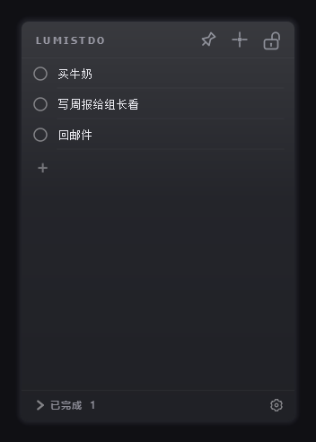
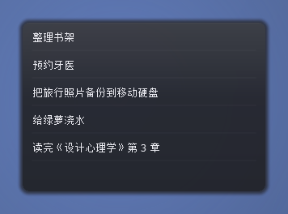
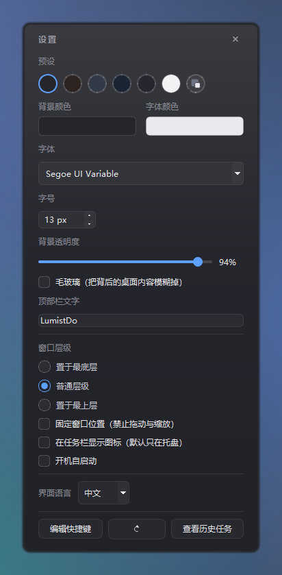
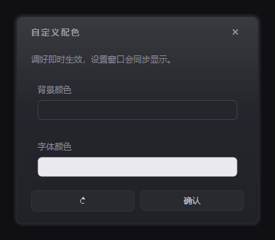
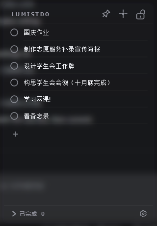
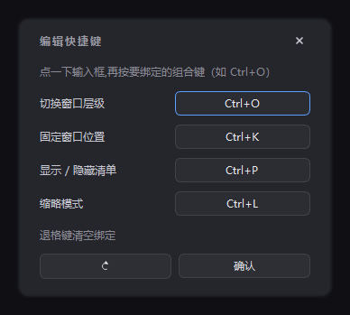

# LumistDo（览明贴）—— 桌面任务便签

**LumistDo（览明贴）** 是一个常驻桌面的任务便签：半透明、无边框、不抢焦点，像贴在壁纸上的便签一样随手记事情，点一下圆点就划掉。

## 功能

- 无边框 + 半透明：贴在桌面上，文字清晰，圆角外区域透明，能看到壁纸
- 拖动顶栏移动窗口，拖边缘缩放；**固定窗口位置**后两者都锁住（防止误拖）
- 点加号创建任务，双击任务文字就地编辑，输入框高度随文字行数变化
- 点任务左侧小圆点 → 任务从桌面消失并标记完成 → 进入底部「已完成」栏
- 点已完成的圆点可恢复回主列表，「已完成」栏本身可以折叠
- 删除任务进入历史任务，可批量恢复或永久删除
- 外观自定义：预设配色、背景/字体颜色、字体、字号、背景透明度、真·毛玻璃（模糊背后内容）、顶部栏文字
- 顶部栏三个按钮（从左到右）：
  - **图钉**：三态循环 —— 普通层级 → 置于最上层 → 置于最底层 → 普通层级
  - **十字锚点**：固定窗口位置（禁止拖动与缩放）
  - **缩略模式**：整条顶栏渐隐，鼠标靠近窗口顶部才露出来；仍可拖动边缘缩放
- 键盘快捷键，可在设置窗口里逐项改键（退格清空即不绑定；重复的自动从旧项上摘掉）
- 启动时不显示在任务栏，改用托盘小图标找回窗口（默认关闭，可随时打开）
- 开机自启动（写当前用户的 Run 注册表项，不需要管理员权限）
- 中英文界面，改语言后提示重启生效
- 数据存 JSON，关掉重开任务还在（不过夜自动刷新）

## 界面

**主界面**（默认「深空」配色，顶部栏从左到右：图钉 / 固定位置 / 缩略模式）



**缩略模式**：只留任务列表，鼠标靠近顶栏才露出图标



**设置窗口**：配色、字体、透明度、顶部栏文字、功能开关、语言都在这里



**自定义配色**：预设行最右边的虚线圆点，单独调背景色与字体颜色，改完即时生效



**毛玻璃预设**：背景几乎全透明，并把背后的桌面内容真正模糊掉（不是"看得见的半透明"，是"透过磨砂玻璃看"）



**编辑快捷键**：点一下输入框，再按想绑定的组合键



## 下载与安装

到 [Releases](https://github.com/1TRhez/LumistDo/releases) 下载 **`LumistDo-Setup-v*.exe`**，双击按向导安装（仅当前用户，不弹 UAC）。

- 默认安装目录：`%LOCALAPPDATA%\Programs\LumistDo`
- 用户数据目录：`%APPDATA%\LumistDo`（安装/更新/卸载都不碰它）
- 卸载时会问一次「是否同时删除用户数据」，选「否」就保留任务和设置
- 程序**没有代码签名**，首次运行 Windows SmartScreen 会提示"未知发布者"，点「更多信息 → 仍要运行」即可

想免安装也可以下载源码自己跑（见下方「开发」）。

## 从更早的版本升级

更早的版本把数据放在 `%APPDATA%\LumistDo`。首次启动 LumistDo 时会自动把那里的 `tasks.json` 与 `settings.json` 搬到 `%APPDATA%\LumistDo`（新目录已有同名文件就不覆盖，搬完清掉旧文件，不会重复搬）——升级不需要手动做任何事。

如果系统里还留着旧版本，确认新版正常后在「应用和功能」里手动卸载即可——**卸载旧版本时如果被问到是否删除用户数据，选「否」**（数据此时已经搬走了，选「是」也只是删掉一个空目录）。

## 使用

### 创建、完成、恢复

| 操作 | 效果 |
| --- | --- |
| 点 `+` / 顶栏 `+` | 新建一条任务，光标自动落在输入框 |
| 双击任务文字 | 就地编辑，回车或点别处保存，`Esc` 取消 |
| 点任务左侧圆点 | 标记完成，任务移到「已完成」栏 |
| 点已完成任务的圆点 | 恢复回主列表 |
| 点「已完成 N」 | 展开/折叠已完成栏 |
| 删除任务 | 进历史任务，可在「查看历史任务」里恢复或永久删除 |

空任务被点完成时直接删除，不会在已完成栏里堆空行。

### 顶部栏三个按钮

| 图标 | 名字 | 作用 |
| --- | --- | --- |
| 图钉 | 窗口层级 | 三态循环：普通 → 最上层 → 最底层 → 普通 |
| 十字锚点 | 固定窗口位置 | 锁住拖动与缩放（再点一次解锁） |
| 缩略模式 | 缩略模式 | 只留清单，顶栏渐隐，鼠标贴顶才露出；仍可拖边缘缩放 |

### 快捷键

| 默认键 | 作用 |
| --- | --- |
| `Ctrl+O` | 切换窗口层级（三态循环） |
| `Ctrl+K` | 固定 / 取消固定窗口位置 |
| `Ctrl+L` | 缩略模式 |
| `Ctrl+N` | 新建任务（固定，不可改） |

设置窗口底部的**「编辑快捷键」**里可以逐项改键：点一下输入框，再按下想绑定的组合键；退格清空表示不绑定；和别的项撞了会自动把旧的那项清掉并提示。

### 设置里都有什么

- **预设**：深空 / 暖夜 / 毛玻璃 / 海洋 / 薰衣草 / 素白，点一下整套换掉，当前选中的那套会亮一圈蓝边
  - 「毛玻璃」会把背后的桌面内容**真正模糊掉**（调用 DWM 的 blur-behind，不是单纯调透明度），所以它的背景只有 9% 不透明度——那点底色用来托住文字对比度，糊成一片的是背后的东西
  - 其余预设都是实底。毛玻璃可以在「背景透明度」下面单独勾选，任何配色都能开；不支持的系统上自动失效，不会报错
  - 浅色预设（素白）的字色是深色，不会出现白底白字；标题与底部「已完成」那些固定的灰也会跟着压暗
- **自定义配色**（预设行最右边那个虚线圆点）：单独调背景颜色与字体颜色，改完即时生效、设置窗口的色块同步跟着变；窗口里的「恢复默认配色」把颜色与预设高亮一起还原成默认的「深空」
- **背景颜色 / 字体颜色**：点色块打开取色器（在预设基础上手改后，高亮会自动切到「自定义配色」）
- **字体 / 字号 / 背景透明度**：字号 11–20，透明度最低 40%
- **顶部栏文字**：默认 `LumistDo`，留空则不显示文字
- **窗口层级**：最底层 / 普通层级 / 最上层
- **固定窗口位置 / 不在任务栏显示图标 / 开机自启动**：三个独立开关
- **界面语言**：中文 / English，改完提示重启生效
- **恢复默认设置**（底部那个圆形箭头）：把外观、快捷键和上面这些功能开关**一起**恢复出厂默认。只有「开机自启动」不动——它写的是系统注册表，静默改掉会让人莫名其妙

## 开发

需要 Python 3.13 与 PySide6。

```bash
python -m pip install -r requirements.txt

# 运行
python main.py

# 跑测试(GUI 用 offscreen 平台,不弹真窗口)
QT_QPA_PLATFORM=offscreen python -m pytest tests/ -q
```

Windows PowerShell 下把环境变量换成 `$env:QT_QPA_PLATFORM="offscreen"`。

### 打包

```powershell
# 1) 先编出 exe 目录:dist\LumistDo\LumistDo.exe
python -m PyInstaller lumistdo.spec --noconfirm

# 2) 再打安装包(需要 Inno Setup 6):release\LumistDo-Setup-v{版本号}.exe
& "$env:LOCALAPPDATA\Programs\Inno Setup 6\ISCC.exe" lumistdo.iss
```

发新版时把 `lumistdo/__init__.py` 的 `APP_VERSION`、`version_info.txt` 的四个版本号、`lumistdo.iss` 的 `MyAppVersion` 一起改掉。

## 目录结构

```
LumistDo-src/
├── main.py                  # 入口:QApplication + MainWindow(含崩溃日志钩子)
├── lumistdo.spec            # PyInstaller 配置(onedir)
├── lumistdo.iss             # Inno Setup 安装脚本
├── version_info.txt         # exe 右键属性里的版本信息
├── AGENTS.md                # 给 AI 编码助手看的项目说明
├── LICENSE                  # MIT
├── assets/icon.ico
├── docs/                    # 本 README 用的截图与介绍页
├── installer/               # Inno Setup 简中语言文件
├── lumistdo/            # 应用包
│   ├── __init__.py              # APP_NAME / APP_NAME_ZH / APP_VERSION
│   ├── app_paths.py             # 数据/日志路径解析 + 旧数据迁移
│   ├── app_settings.py          # 设置模型、预设、快捷键解析、容器背景样式
│   ├── blur_behind.py           # 真·毛玻璃:调 DWM 把窗口背后模糊掉
│   ├── floating_window.py       # 浮动窗口共享件:羽化边缘、自绘关闭按钮、色块
│   ├── json_io.py               # 原子写入
│   ├── task_store.py            # 数据层:Task / TaskStore
│   ├── task_item.py             # 单条任务(圆点 + 编辑框,高度自适应)
│   ├── completed_panel.py       # 已完成面板
│   ├── history_window.py        # 历史任务窗口
│   ├── settings_dialog.py       # 设置窗口
│   ├── keybind_window.py        # 编辑快捷键窗口
│   ├── tray_icon.py             # 托盘图标
│   ├── autostart.py             # 开机自启动(注册表 Run 项)
│   ├── single_instance.py       # 单实例锁
│   ├── dialogs.py               # 消息框(切断父窗口深色样式继承)
│   ├── i18n.py                  # 中英文文案表
│   └── main_window.py           # 主窗口:拖动/缩放/渐隐/快捷键/落盘
└── tests/
    ├── test_app_paths.py
    ├── test_app_settings.py
    ├── test_task_store.py
    └── test_gui_smoke.py    # GUI 冒烟测试(offscreen)
```

## 设计要点

- **数据与 UI 分离**：`TaskStore` 只管数据和持久化，不依赖 Qt；`MainWindow` 持有它并在交互时调用。所以数据层能单独跑单测。
- **任务对象同一引用**：`TaskItem.task` 和 `store.tasks` 里是同一个对象，编辑后本地与 store 同步。
- **圆点不抢焦点**：`TaskItem.dot` 设 `Qt.NoFocus`，点完成时不会触发输入框的 `editingFinished`，避免完成与保存逻辑打架。
- **半透明 + 圆角**：窗口 `WA_TranslucentBackground` + 容器 `rgba` 背景，文字不透明，圆角外透明。
- **真·毛玻璃只能靠 DWM**：普通半透明窗口是"清清楚楚地看见背后"，要让背后变糊必须调未公开的 `SetWindowCompositionAttribute` + `ACCENT_ENABLE_BLURBEHIND`。实测这台 Win11 上 `ACCENT_ENABLE_ACRYLICBLURBEHIND`(4) 与 `ACCENT_ENABLE_HOSTBACKDROP`(5) 都返回成功但**什么都不做**，已废弃的 `DwmEnableBlurBehindWindow` 同样不生效——所以别被返回值骗了，只有 3 真的糊。整块用 `getattr` 取函数、失败静默降级，不支持的系统上只是没有毛玻璃。
- **背景用三档垂直渐变而不是两档**：两档渐变要把色差摊满整个窗口高度，8bit 量化下会出现一条条水平色带；三档（上/中/下）把色差压在很小的范围里，毛玻璃预设那种轻微立体感才干净。三个窗口的背景都由 `app_settings.container_qss()` 生成，不会各自漂移。
- **渐隐**：只有缩略模式会让顶栏渐隐，显隐由"鼠标是否贴在顶栏矩形内"驱动；此外点击窗口能把顶栏临时唤回 3 秒（`_reveal_until`）。
- **透明度特效必须丢引用**：Qt 的 `widget.setGraphicsEffect(None)` 会**直接 delete 掉**那个 `QGraphicsOpacityEffect`，缓存的引用立刻变成野指针（再碰就是 `Internal C++ object already deleted`）。所以每次摘掉特效后都要把缓存清空（`_forget_effect`）。
- **清单区不能用 `setVisible(False)` 隐藏**：`QScrollArea` 一旦不可见就不再重算几何，内部 widget 会卡在 638px 宽并把任务行撑出窗口。要折叠就收高度（`_set_widget_shown` 用 `setMaximumHeight`）。
- **自绘图标按钮要设 `accessibleName`**：否则 UI 自动化（含无障碍工具）读到的是空名字，按名字点不到。
- **窗口尺寸会写回设置**：拖动/缩放结束后落盘，重启回到原位。
- **任务数据立即落盘**：增删改都当场写 JSON（原子写入），180ms 去抖；窗口几何与开关同理。
- **设置窗口自绘外观**：无边框 + 自绘标题栏 + 边缘羽化，避免系统标题栏和深色半透明主题打架。
- **托盘图标**：只在「不在任务栏显示图标」打开时出现，左键单击显示/隐藏主窗口，右键菜单可显示或退出。

## 已知限制

- Windows 专用：开机自启动用的是注册表 Run 项，其他平台会当成"不支持"。
- 程序没有代码签名，SmartScreen 会提示未知发布者。
- 仅本机存储，没有云同步、没有账号，也不联网（除了手动点「查看历史任务」等本地操作，程序本身不发起网络请求）。

## 许可

MIT 许可证，`Copyright (c) 2026 1TRhez`，完整条款见 [LICENSE](LICENSE)。

致谢：[PySide6 / Qt for Python](https://doc.qt.io/qtforpython-6/)、[PyInstaller](https://pyinstaller.org/)、[Inno Setup](https://jrsoftware.org/isinfo.php)。
