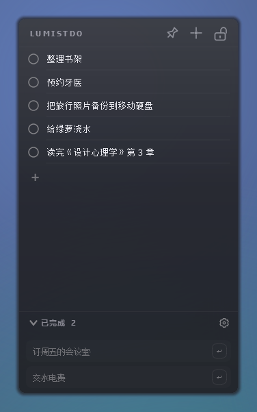
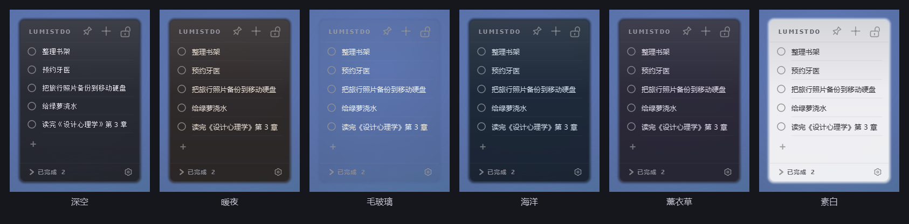
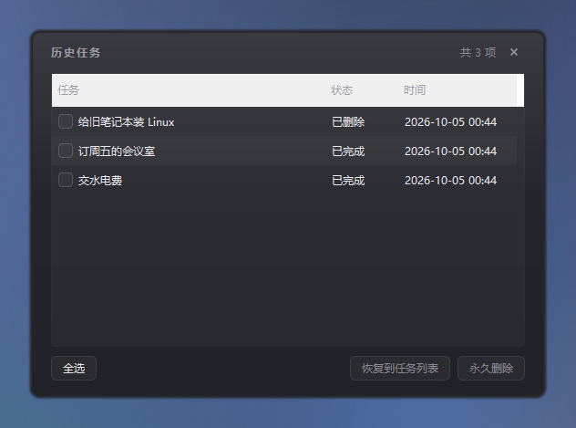

# LumistDo（览明贴）—— 桌面任务便签

<p align="center">
  
</p>

**LumistDo（览明贴）** 是一个常驻桌面的任务便签：半透明、无边框、不抢焦点，像贴在壁纸上的便签一样随手记事情，点一下圆点就划掉。

Windows 10 / 11 · 单文件 exe 安装 · 数据只存在本机 · MIT 许可

## 界面预览

### 主界面

默认「深空」配色。顶部栏从左到右：图钉（窗口层级）/ 十字锚点（固定位置）/ 缩略模式；底部是「已完成」栏与设置入口。


### 展开「已完成」

勾掉的任务不会消失，而是收进底部「已完成 N」里；点那一行展开，点圆点就地还原。



### 缩略模式

只留任务列表：整条顶栏渐隐，鼠标贴到窗口顶部才露出来，点一下窗口也能临时唤回 3 秒；仍然可以拖边缘缩放。


### 设置窗口

配色、字体、字号、透明度、毛玻璃、顶部栏文字、窗口层级、三个功能开关、界面语言都在这一页；底部还有「编辑快捷键」与「查看历史任务」。


### 六套预设配色

深空 / 暖夜 / 毛玻璃 / 海洋 / 薰衣草 / 素白，点一下整套换掉（同尺寸实拍，从左到右依次排列）。



### 自定义配色

预设行最右边那个虚线圆点：单独挑背景色和字体色，改完立刻生效，设置窗口的色块同步跟着变。


### 毛玻璃

背景几乎全透明，并把**背后的桌面内容真正模糊掉**——不是"看得见的半透明"，而是"透过磨砂玻璃看"。亮着的时候卡片照样是圆角、照样带边缘羽化。


### 编辑快捷键

点一下输入框，再按下想绑定的组合键即可；退格清空表示不绑定，和别的项撞了会自动把旧的那项摘掉。


### 历史任务

已完成和已删除的任务都在这里，勾选后可以批量恢复到任务列表，或永久删除。



## 功能

### 记录与整理

- **随手写**：点列表里的 `+` 或顶栏 `+`（也可以按 `Ctrl+N`）新建一条，光标自动落进输入框
- **就地编辑**：双击任务文字进入编辑，回车或点别处保存，`Esc` 取消；文字长了自动换行，行高跟着变
- **点圆点完成**：任务立刻从桌面消失、收进底部「已完成」栏，计数同步更新
- **还原**：点已完成任务的圆点，或者展开「已完成」栏后点它，任务回到主列表；「已完成」栏本身可以折叠
- **拖动排序**：按住任务行上下拖就能换位置（拖到列表上下边缘还会自动滚），松手即保存顺序
- **右键任务**：编辑 / 删除；删除的任务进历史任务，可以再恢复或永久删除
- **空任务不留痕**：新建了却没输入内容的任务被取消或完成时直接消失，不进历史任务
- **空清单有提示**：一条任务都没有时，列表里会显示「暂无任务 —— 点击上方 + 或按 Ctrl+N 新建」
- 清单长了可以用滚轮翻，不会把窗口撑破

### 窗口与外观

- **无边框 + 半透明 + 圆角**：贴在桌面上，文字清晰，圆角外透明，能看到壁纸；卡片外还有一圈柔和的羽化
- **拖动顶栏移动窗口，拖 8 个方向缩放**；尺寸和位置写回设置，重启回到原位
- **固定窗口位置**（顶栏十字锚点或 `Ctrl+Alt+2`）：拖动与缩放一起锁住，防止误拖
- **窗口层级三态**（顶栏图钉或 `Ctrl+Alt+1`）：普通层级 → 置于最上层 → 置于最底层 → 普通层级，状态跨重启保持
- **缩略模式**（顶栏锁形图标或 `Ctrl+Alt+3`）：整条顶栏渐隐，只留清单
- **毛玻璃**：可选的真·背景模糊，任何配色都能单独勾上；不支持的系统上自动失效，不会报错
- **外观自定义**：六套预设 + 自定义配色 + 字体（下拉框可直接搜字体名）/ 字号 11–20 / 背景透明度 / 顶部栏文字（留空则不显示文字）
- **顶部栏右键**：最小化 / 退出

### 托盘、启动与后台

- **默认只在托盘**，不占任务栏：托盘图标左键单击显示 / 隐藏窗口，右键菜单里可以显示窗口或退出
- 想在任务栏里看到它，就在设置里勾上**「在任务栏显示图标」**
- **开机自启动**：写当前用户的 Run 注册表项，不需要管理员权限
- **单实例**：重复启动不会开出第二个窗口，会把已有窗口叫出来并提示「已在运行」
- **崩溃留证据**：万一异常退出，详情会写进数据目录的 `crash.log`
- 数据存 JSON、原子写入，增删改与开关都当场落盘，关掉重开任务还在

### 键盘

- `Ctrl+N` 新建任务（固定在窗口级，不可改绑）
- `Ctrl+Alt+1 / 2 / 3` 默认注册成**系统级热键**：窗口没被选中、甚至在别的软件里打字时也能切换层级 / 固定位置 / 缩略模式
- 三个动作都能在「编辑快捷键」里逐项改键；某个组合键已被别的软件占用时，**只有那一个动作**安静退回窗口级绑定，不影响另外两个
- 界面支持**中文 / English**，改完提示重启生效

## 下载与安装

到 [Releases](https://github.com/1TRhez/LumistDo/releases) 下载 **`LumistDo-Setup-v*.exe`**，双击按向导安装（仅当前用户，不弹 UAC）。

- 默认安装目录：`%LOCALAPPDATA%\Programs\LumistDo`
- 用户数据目录：`%APPDATA%\LumistDo`（安装/更新/卸载都不碰它）
- 卸载时会问一次「是否同时删除用户数据」，选「否」就保留任务和设置
- 程序**没有代码签名**，首次运行 Windows SmartScreen 会提示"未知发布者"，点「更多信息 → 仍要运行」即可

想免安装也可以下载源码自己跑（见下方「开发」）。

## 从更早的版本升级

升级不需要手动做任何事：任务和设置都在 `%APPDATA%\LumistDo` 里，装上新版照旧读取（安装/更新/卸载都不会碰它）。

如果系统里还留着旧版本，确认新版正常后在「应用和功能」里手动卸载即可——**卸载旧版本时如果被问到是否删除用户数据，选「否」**（数据此时已经搬走了，选「是」也只是删掉一个空目录）。

## 使用

### 创建、完成、恢复

| 操作 | 效果 |
| --- | --- |
| 点 `+` / 顶栏 `+` / `Ctrl+N` | 新建一条任务，光标自动落在输入框 |
| 双击任务文字 | 就地编辑，回车或点别处保存，`Esc` 取消 |
| 点任务左侧圆点 | 标记完成，任务移到「已完成」栏 |
| 点已完成任务的圆点 | 恢复回主列表 |
| 点「已完成 N」 | 展开/折叠已完成栏 |
| 按住任务行上下拖 | 调整顺序（拖到列表边缘会自动滚动） |
| 右键任务行 | 编辑 / 删除 |
| 删除任务 | 进历史任务，可在「查看历史任务」里恢复或永久删除 |

空任务被点完成时直接删除，不会在已完成栏里堆空行。

### 顶部栏三个按钮

| 图标 | 名字 | 作用 |
| --- | --- | --- |
| 图钉 | 窗口层级 | 三态循环：普通 → 最上层 → 最底层 → 普通 |
| 十字锚点 | 固定窗口位置 | 锁住拖动与缩放（再点一次解锁） |
| 缩略模式 | 缩略模式 | 只留清单，顶栏渐隐，鼠标贴顶才露出；仍可拖边缘缩放 |

鼠标停在图标上会显示提示，并带上当前的快捷键。

### 托盘图标

| 操作 | 效果 |
| --- | --- |
| 左键单击托盘图标 | 显示 / 隐藏主窗口（最小化后也这样叫回来） |
| 右键托盘图标 | 「显示 / 隐藏窗口」、分隔线、「退出」 |

默认只在托盘、不占任务栏，所以关掉主窗口（或最小化）之后，托盘图标就是把它找回来的入口。勾上「在任务栏显示图标」后主窗口会进任务栏，托盘图标随之收起。

### 快捷键

| 默认键 | 作用 |
| --- | --- |
| `Ctrl+Alt+1` | 切换窗口层级（三态循环） |
| `Ctrl+Alt+2` | 固定 / 取消固定窗口位置 |
| `Ctrl+Alt+3` | 缩略模式 |
| `Ctrl+N` | 新建任务（固定，不可改，需要窗口在前台） |

这三个动作默认注册成**系统级热键**：窗口没被选中、甚至在别的软件里打字时也能触发——因为它们本来就是「在别的窗口里顺手拨一下」的操作。`Ctrl+N` 要往输入框里打字，所以仍然是窗口级的，必须主界面在前台。

副作用要知道：系统级热键是**独占**的，注册期间别的程序收不到这个组合键。所以出厂绑定选的是带 `Alt` 的 `Ctrl+Alt+1/2/3`——没带修饰键的会吃掉整个键盘，而 `Ctrl+O`/`Ctrl+K`/`Ctrl+L`、`Ctrl+Alt+O/L` 这些太好用的组合在本机上实测已经被别的软件占着，抢过来会让对方失灵。如果某个键已经被别的程序先占了，LumistDo 会**只把那一个动作**退回窗口级绑定，不影响另外两个。

（升级提醒：老版本用的 `Ctrl+O`/`Ctrl+K`/`Ctrl+L` 会在启动时**自动迁移**成新的默认值——只迁移「还是出厂值」的那些，你自己改过的绑定一个都不动。）

全局可用是**默认开启、没有开关**的：这三个动作天生就是「在别的窗口里顺手拨一下」的用途，要求窗口被选中等于没用。真有个别组合键被别的软件先占了，只有那一个动作会安静退回窗口级，不影响另外两个。

设置窗口底部的**「编辑快捷键」**里可以逐项改键：点一下输入框，再按下想绑定的组合键；退格清空表示不绑定；和别的项撞了会自动把旧的那项清掉并提示。

### 设置里都有什么

- **预设**：深空 / 暖夜 / 毛玻璃 / 海洋 / 薰衣草 / 素白，点一下整套换掉，当前选中的那套会亮一圈蓝边
  - 「毛玻璃」会把背后的桌面内容**真正模糊掉**（调用 DWM 的 blur-behind，不是单纯调透明度），所以它的背景只有 9% 不透明度——那点底色用来托住文字对比度，糊成一片的是背后的东西
  - 其余预设都是实底。毛玻璃可以在「背景透明度」下面单独勾选，任何配色都能开；不支持的系统上自动失效，不会报错
  - 开着毛玻璃时窗口**照样是圆角的、也照样带羽化**：系统给的模糊区永远是一整块方矩形，裁不出也圆不了，所以反过来让背景去对齐它——背景铺满整扇窗口，只多出四个角上十来平方像素的残糊（背景透明度拉到最高时能隐约看见一点）；卡片外面那圈柔和的羽化则改由一个贴在窗口外面的透明光环窗口来画，所以开不开毛玻璃看起来都是同一张带羽化的圆角卡片（勾不勾毛玻璃，卡片的大小和位置一个像素都不动）
  - 浅色预设（素白）的字色是深色，不会出现白底白字；标题与底部「已完成」那些固定的灰也会跟着压暗
- **自定义配色**（预设行最右边那个虚线圆点）：单独调背景颜色与字体颜色，改完即时生效、设置窗口的色块同步跟着变；窗口里的「恢复默认配色」把颜色与预设高亮一起还原成默认的「深空」
- **背景颜色 / 字体颜色**：点色块打开取色器（在预设基础上手改后，高亮会自动切到「自定义配色」）
- **字体 / 字号 / 背景透明度**：字体下拉框可以直接搜索字体名；字号 11–20，透明度最低 40%。这三样都**不响应滚轮**——鼠标划过时滚一下就把字体/字号/透明度改掉太容易误触
- **顶部栏文字**：默认 `LumistDo`，留空则不显示文字
- **窗口层级**：最底层 / 普通层级 / 最上层
- **固定窗口位置 / 在任务栏显示图标 / 开机自启动**：三个独立开关（**默认只在托盘**，不占任务栏；想让它出现在任务栏就勾上这一项）
- **界面语言**：中文 / English，改完提示重启生效
- **恢复默认设置**（底部那个圆形箭头）：把外观、快捷键和上面这些功能开关**一起**恢复出厂默认。只有「开机自启动」不动——它写的是系统注册表，静默改掉会让人莫名其妙

## 开发

需要 Python 3.13 与 PySide6。

```bash
python -m pip install -r requirements.txt

# 运行
python main.py

# 跑测试(GUI 用 offscreen 平台,不弹真窗口)
QT_QPA_PLATFORM=offscreen python -m pytest tests/ -q
```

Windows PowerShell 下把环境变量换成 `$env:QT_QPA_PLATFORM="offscreen"`。

### 打包

```powershell
# 1) 先编出 exe 目录:dist\LumistDo\LumistDo.exe
python -m PyInstaller lumistdo.spec --noconfirm

# 2) 再打安装包(需要 Inno Setup 6):release\LumistDo-Setup-v{版本号}.exe
& "$env:LOCALAPPDATA\Programs\Inno Setup 6\ISCC.exe" lumistdo.iss
```

发新版时把 `lumistdo/__init__.py` 的 `APP_VERSION`、`version_info.txt` 的四个版本号、`lumistdo.iss` 的 `MyAppVersion` 一起改掉。

## 目录结构

```
LumistDo-src/
├── main.py                  # 入口:QApplication + MainWindow(含崩溃日志钩子)
├── lumistdo.spec            # PyInstaller 配置(onedir)
├── lumistdo.iss             # Inno Setup 安装脚本
├── version_info.txt         # exe 右键属性里的版本信息
├── AGENTS.md                # 给 AI 编码助手看的项目说明
├── LICENSE                  # MIT
├── assets/icon.ico          # 应用图标(多尺寸);icon.svg 是矢量源
├── assets/icon.svg
├── docs/                    # 本 README 用的截图与介绍页
├── installer/               # Inno Setup 简中语言文件
├── lumistdo/            # 应用包
│   ├── __init__.py              # APP_NAME / APP_NAME_ZH / APP_VERSION
│   ├── app_paths.py             # 数据/日志路径解析 + 便携版数据迁移
│   ├── app_settings.py          # 设置模型、预设、快捷键解析、容器背景样式
│   ├── blur_behind.py           # 真·毛玻璃:调 DWM 把窗口背后模糊掉
│   ├── edge_fade.py             # 羽化环带画法(光环窗口用)
│   ├── edge_halo.py             # 光环窗口(画窗口外那圈羽化,始终跟着主窗口)
│   ├── floating_window.py       # 浮动窗口共享件:羽化边缘、自绘关闭按钮、色块
│   ├── json_io.py               # 原子写入
│   ├── task_store.py            # 数据层:Task / TaskStore
│   ├── task_item.py             # 单条任务(圆点 + 编辑框,高度自适应)
│   ├── completed_panel.py       # 已完成面板
│   ├── history_window.py        # 历史任务窗口
│   ├── settings_dialog.py       # 设置窗口
│   ├── keybind_window.py        # 编辑快捷键窗口
│   ├── tray_icon.py             # 托盘图标
│   ├── autostart.py             # 开机自启动(注册表 Run 项)
│   ├── single_instance.py       # 单实例锁
│   ├── dialogs.py               # 消息框(切断父窗口深色样式继承)
│   ├── i18n.py                  # 中英文文案表
│   └── main_window.py           # 主窗口:拖动/缩放/渐隐/快捷键/落盘
└── tests/
    ├── test_app_paths.py
    ├── test_app_settings.py
    ├── test_task_store.py
    └── test_gui_smoke.py    # GUI 冒烟测试(offscreen)
```

## 设计要点

- **数据与 UI 分离**：`TaskStore` 只管数据和持久化，不依赖 Qt；`MainWindow` 持有它并在交互时调用。所以数据层能单独跑单测。
- **任务对象同一引用**：`TaskItem.task` 和 `store.tasks` 里是同一个对象，编辑后本地与 store 同步。
- **圆点不抢焦点**：`TaskItem.dot` 设 `Qt.NoFocus`，点完成时不会触发输入框的 `editingFinished`，避免完成与保存逻辑打架。
- **半透明 + 圆角**：窗口 `WA_TranslucentBackground` + 容器 `rgba` 背景，文字不透明，圆角外透明。开毛玻璃时圆角也保留；边缘那圈羽化必须在窗口**外面**才画得出来（窗口里已经被铺满的背景和糊区占满了），所以它由 `edge_halo.EdgeHalo` 这个附属透明窗口去画（见下一条）。
- **真·毛玻璃只能靠 DWM**：普通半透明窗口是"清清楚楚地看见背后"，要让背后变糊必须调未公开的 `SetWindowCompositionAttribute` + `ACCENT_ENABLE_BLURBEHIND`。实测这台机器是 Windows 10 Pro 22H2（19045），`ACCENT_ENABLE_ACRYLICBLURBEHIND`(4) 与 `ACCENT_ENABLE_HOSTBACKDROP`(5) 都返回成功但**什么都不做**，已废弃的 `DwmEnableBlurBehindWindow` 同样不生效——所以别被返回值骗了，只有 3 真的糊。整块用 `getattr` 取函数、失败静默降级，不支持的系统上只是没有毛玻璃。
- **模糊永远是"整个窗口矩形"、永远方角，所以只能反过来让背景去对齐它**：`SetWindowRgn` 设了圆角窗口区域也裁不掉模糊（返回成功、区域也确实设上了，画面纹丝不动），`DWMWA_WINDOW_CORNER_PREFERENCE` 在 Win10 上直接 `E_INVALIDARG`，连窗口自己的 alpha 都不看（透明度压到 0 里面照样糊）。于是容器的 8px 留白**恒为 0**（跟毛玻璃开关无关），让可见背景的外接矩形严丝合缝地盖住模糊区——不然糊出来的那块会比背景整圈大 8px。圆角照常保留：四个角各剩十来平方像素的残糊，背景透明度拉满时能隐约看见，比"内缩 8px"那种整圈大一圈小得多（关掉毛玻璃不改任何尺寸：留白照样是 0，羽化照样由光环窗口画在窗外，只把背后的模糊去掉）。
- **羽化画在窗口外面，靠一个附属的"光环窗口"**：羽化是好几层向外扩散的同心圆角环带，必须落在窗口**外面**才看得见；可是窗口里被铺满的背景（开着毛玻璃时还有糊区）占满了，没地方画。所以 `lumistdo/edge_halo.py` 的 `EdgeHalo` 是一个比主窗口四周各宽 8px 的透明附属窗口，只画那圈环带、中间全透明，作为主窗口的 owned window（`Qt.Tool`）不进任务栏也不进 Alt+Tab，还设了鼠标穿透、不抢焦点；环带画法与主窗口共用 `lumistdo/edge_fade.py` 的 `paint_edge_fade()`。它由 `MainWindow._sync_halo()` 统一跟着窗口搬家，拖动/缩放时在 `move()`/`setGeometry()` 的同一轮里再同步一次，否则光环会晚一拍落在卡片后面像拖影。
- **背景用三档垂直渐变而不是两档**：两档渐变要把色差摊满整个窗口高度，8bit 量化下会出现一条条水平色带；三档（上/中/下）把色差压在很小的范围里，毛玻璃预设那种轻微立体感才干净。三个窗口的背景都由 `app_settings.container_qss()` 生成，不会各自漂移。
- **渐隐**：只有缩略模式会让顶栏渐隐，显隐由"鼠标是否贴在顶栏矩形内"驱动；此外点击窗口能把顶栏临时唤回 3 秒（`_reveal_until`）。
- **透明度特效必须丢引用**：Qt 的 `widget.setGraphicsEffect(None)` 会**直接 delete 掉**那个 `QGraphicsOpacityEffect`，缓存的引用立刻变成野指针（再碰就是 `Internal C++ object already deleted`）。所以每次摘掉特效后都要把缓存清空（`_forget_effect`）。
- **清单区不能用 `setVisible(False)` 隐藏**：`QScrollArea` 一旦不可见就不再重算几何，内部 widget 会卡在 638px 宽并把任务行撑出窗口。要折叠就收高度（`_set_widget_shown` 用 `setMaximumHeight`）。
- **自绘图标按钮要设 `accessibleName`**：否则 UI 自动化（含无障碍工具）读到的是空名字，按名字点不到。
- **窗口尺寸会写回设置**：拖动/缩放结束后落盘，重启回到原位。
- **任务数据立即落盘**：增删改都当场写 JSON（原子写入），180ms 去抖；窗口几何与开关同理。
- **设置窗口自绘外观**：无边框 + 自绘标题栏 + 边缘羽化，避免系统标题栏和深色半透明主题打架。它里面的字体下拉、字号框、透明度滑块都刻意**不吃滚轮**，免得鼠标划过时把设置改花。
- **托盘图标**：默认就常驻（因为默认不在任务栏显示），左键单击显示/隐藏主窗口，右键菜单可显示或退出。关掉「在任务栏显示图标」后它一直在；勾上之后主窗口会进任务栏，托盘图标收起。系统没有托盘时不会既关任务栏图标又没有入口——`TrayIcon.set_visible()` 会返回"托盘不可用"，窗口改为保留任务栏图标。

## 已知限制

- Windows 专用：开机自启动用的是注册表 Run 项，其他平台会当成"不支持"。
- 程序没有代码签名，SmartScreen 会提示未知发布者。
- 仅本机存储，没有云同步、没有账号，也不联网（除了手动点「查看历史任务」等本地操作，程序本身不发起网络请求）。

## 许可

MIT 许可证，`Copyright (c) 2026 1TRhez`，完整条款见 [LICENSE](LICENSE)。

致谢：[PySide6 / Qt for Python](https://doc.qt.io/qtforpython-6/)、[PyInstaller](https://pyinstaller.org/)、[Inno Setup](https://jrsoftware.org/isinfo.php)。
